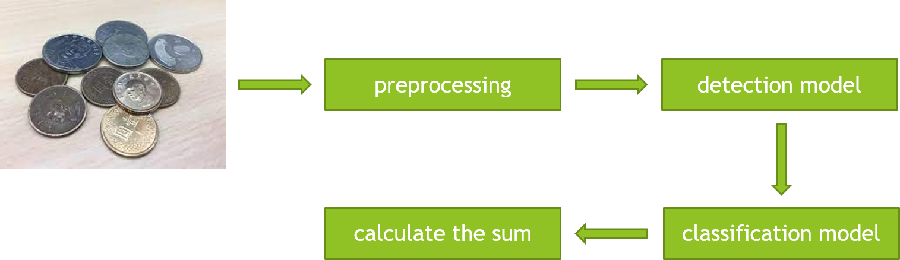
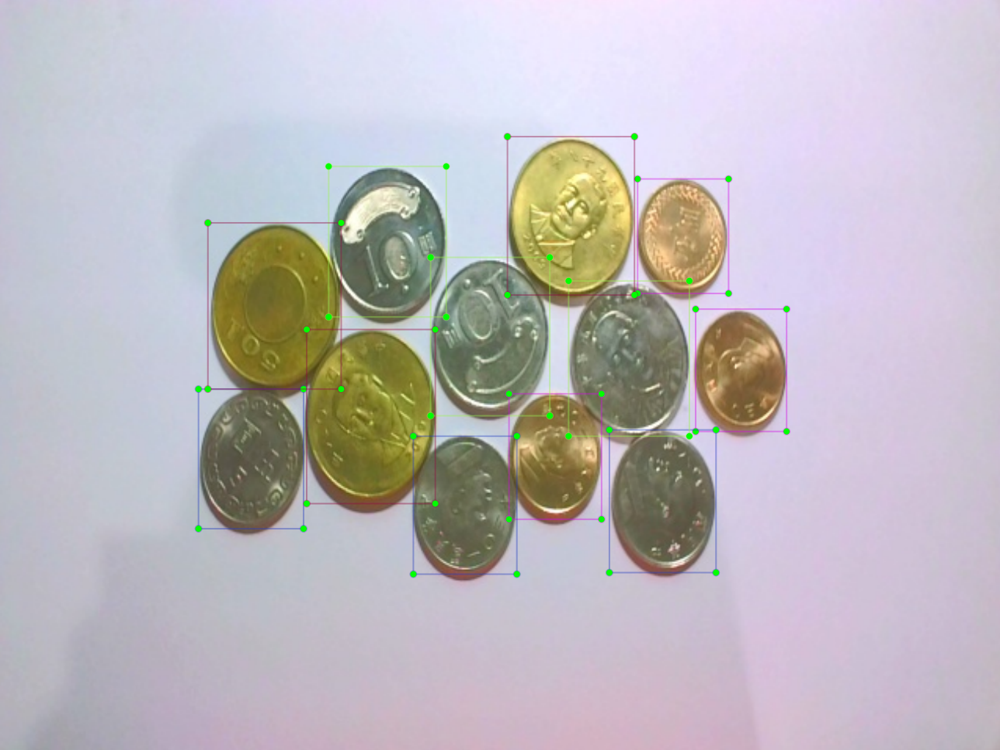
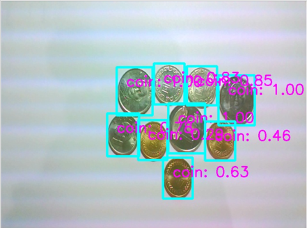
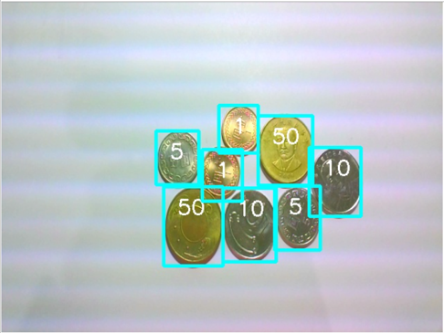
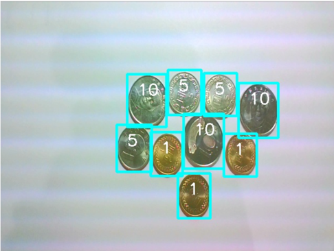

# Coin counter

This repository implements a computer vision based coin counter with deep learning method. Use the detection model to predict the position of all coins in the image, and then use the classification model to classify all coins. According to the amount represented by different coins, the total amount of all coins is automatically calculated.

<div align="center">

</div>

## Table of Contents

- [Getting Started](#getting-started)
  - [Prerequisites](#prerequisites)
  - [Installation](#installation)
  - [Dataset preparation](#dataset-preparation)
  - [ImageNet pre-trained weights preparation](#imagenet-pre-trained-weights-preparation)
- [Usage](#usage)
  - [Training](#training)
  - [Test](#test)
- [Experiment Results](#experiment-results)
  - [Coin detection](#coin-detection)
  - [Coin classification](#coin-classification)
  - [Coin recognition results](#coin-recognition-results)
- [License](#license)
- [Acknowledgments](#acknowledgments)

## Getting Started
### Prerequisites

- Python 3.7.11 conda environment
- PyTorch 1.8.2 LTS with CUDA 11.1

### Installation

```bash
git clone https://github.com/ChienHsuan/coin-counter.git
cd coin-counter
pip install -r requirements.txt
```

### Dataset preparation

Collect the New Taiwan Dollar (NT$) coin dataset, and use [LabelImg](https://github.com/heartexlabs/labelImg) to label the dataset. In this repository, there are totally 300 images in the dataset, including 260 training set images, 20 validation set images, and 20 test set images. The sample image of the dataset is shown below. Moreover, arrange the image paths as follows:

<div align="center">

</div>

```
/USER-DEFINED-PATH/coins/
                      ├── Train/
                      │       ├── coins_0.jpg
                      │       ├── coins_1.jpg
                      │       ├── ...
                      ├── Validation/...
                      └── Test/...
```

### ImageNet pre-trained weights preparation

Download the [ImageNet](https://image-net.org/) pre-trained weights of [MobileNetV2](https://arxiv.org/abs/1801.04381) and [ResNet-50](https://arxiv.org/abs/1512.03385) models from this [link](https://drive.google.com/drive/folders/1E7_LNJThaS5px-1PtRvl8wIERSaLHEWD?usp=sharing). In addition, arrange the model paths as follows:

```
coin-counter/pre-trained_models/
                      ├── mb2-imagenet-71_8.pth
                      ├── mobilenet_v2-b0353104.pth
                      └── resnet50-19c8e357.pth
```

## Usage
### Training

All training procedures include detection model training and classification model training. Use MobileNetV2 SSDLite as detection model. MobileNetV2 and ResNet-50 are used as classification models.

#### Detection model

Use the MobileNetV2 as backbone, and couple the backbone with the SSDLite detection network. It is turned into the MobileNetV2 SSDLite detection model, and acts as a coin detector. To train the detection model, execute the command:

```bash
bash train.sh
```

The path to the trained MobileNetV2 SSDLite detection model is as follows:

```
/coin-counter/trained-models/
                    └── mb2_ssdlite-Epoch-{epoch}-Loss-{val_loss}.pth
```

#### Classification model

Use MobileNetV2 and ResNet-50 classification models as coin classifier. To train a classification model, execute the command:

```bash
python classification.py
```

The paths for the trained MobileNetV2 and ResNet-50 classification models are as follows:

```
/coin-counter/trained-models/
                    ├── resnet50.pth
                    └── mobilenetv2.pth
```

Change the dataset and model related arguments in training scripts as required.

### Test

Use the evaluation metric **Average Precision (AP)** to evaluate the prediction accuracy of the detection model. Use **classification accuracy** to evaluate the coin classification accuracy of the classification model.

```bash
bash eval.sh
```

Change the dataset and model related arguments in test scripts as required.

## Experiment Results
### Coin detection

The following are the experiment results of the MobileNetV2 SSDLite detection model.

| Model | AP[IoU=0.5] | AP[IoU=0.7] | AP[IoU=0.9] |
| :---: | :---: | :---: | :---: |
| MobileNetV2 SSDLite | 1.0 | 1.0 | 0.736 |

<div align="center">

</div>

### Coin classification

The following are the experiment results of the MobileNetV2 and ResNet-50 classification models.

#### 1. MobileNetV2

| coin type | accuracy |
| :---: | :---: |
| coin 1 | 100% |
| coin 5 | 100% |
| coin 10 | 100% |
| coin 50 | 100% |

#### 2. ResNet-50

| coin type | accuracy |
| :---: | :---: |
| coin 1 | 100% |
| coin 5 | 100% |
| coin 10 | 100% |
| coin 50 | 100% |

### Coin recognition results

The following are the coin recognition results of the test set images.

<div align="center">

</div>

<div align="center">

</div>

See the documentation in `docs/` for more details.

## License

The MIT License (MIT)  
Copyright (c) 2022 Chien-Hsuan Yen

## Acknowledgments

[Single Shot MultiBox Detector Implementation in Pytorch](https://github.com/qfgaohao/pytorch-ssd)  
[LabelImg](https://github.com/heartexlabs/labelImg)  
